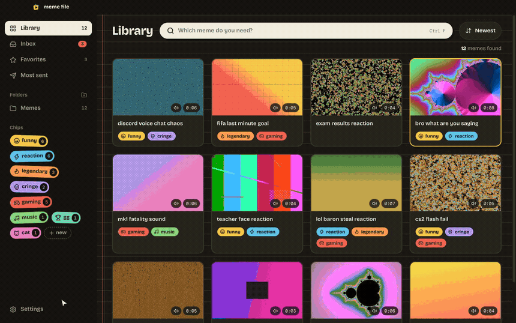
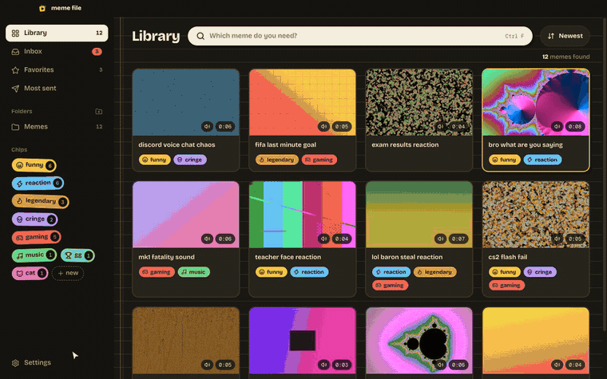
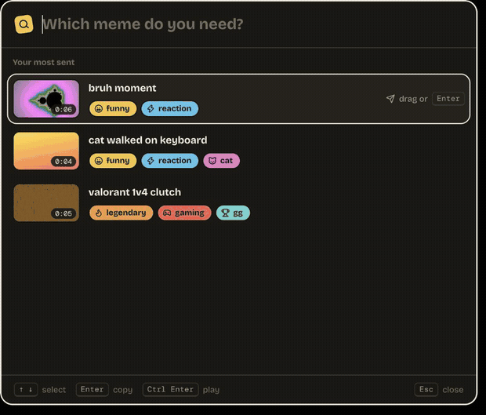
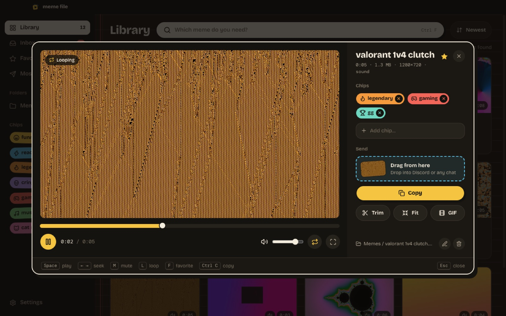
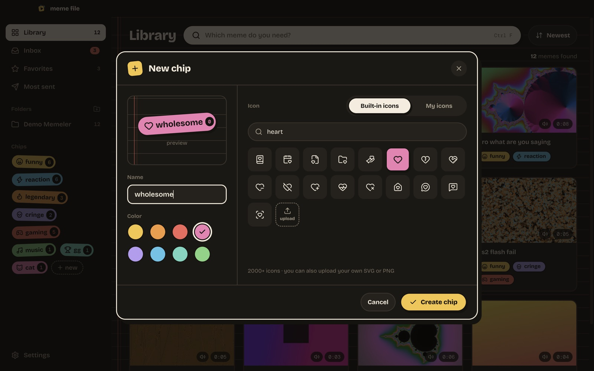
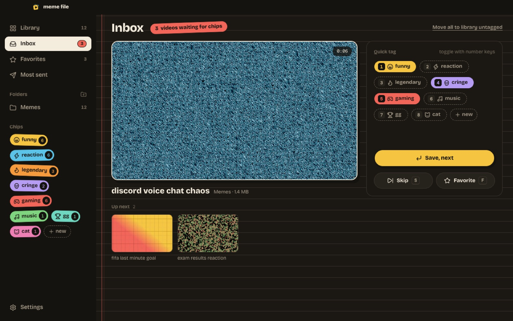
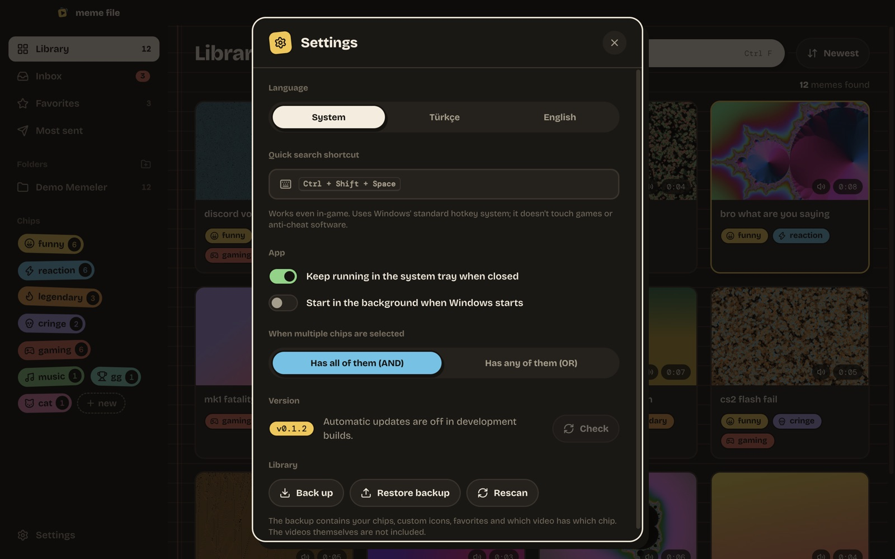
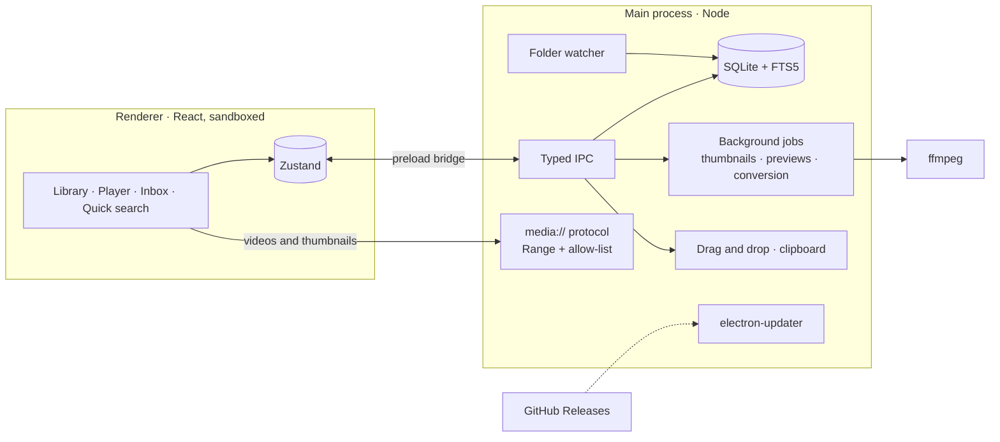

<div align="center">


# Meme File

**Your reaction video library.<br/>Tag it with chips, find it in a second, drag it straight into Discord.**

[](https://github.com/Enver-Onur-Cogalan/meme-file/actions/workflows/build.yml)
[](https://github.com/Enver-Onur-Cogalan/meme-file/releases/latest)

[](LICENSE)


[**Download for Windows**](https://github.com/Enver-Onur-Cogalan/meme-file/releases/latest) &nbsp;·&nbsp; [Türkçe](README.tr.md) &nbsp;·&nbsp; [Project plan](docs/PLAN.md)

<br/>



</div>

## Why

Reaction videos pile up by the hundreds, and finding the right one while the moment is still funny takes too long.
Meme File watches your folders, builds a thumbnail and a scrubbable preview for every clip, lets you tag them with
colorful chips, and sends the one you need to a chat in a single gesture. Your files never move; the app only adds a
tagging layer on top of them.

## Highlights

<table>
<tr>
<td width="33%" valign="top"><b>Find in seconds</b><br/>Search by name or chip, combine chips with AND/OR, scrub a clip by hovering over it.</td>
<td width="33%" valign="top"><b>Send in one move</b><br/>Drag a card into Discord or press <code>Ctrl+C</code> and paste. Works for several videos at once.</td>
<td width="33%" valign="top"><b>Summon from anywhere</b><br/><code>Ctrl+Shift+Space</code> opens a quick search over whatever you're doing, even in-game.</td>
</tr>
<tr>
<td valign="top"><b>Fits Discord's limit</b><br/>Trim and shrink a clip under 10 MB (or export a GIF) without touching the original.</td>
<td valign="top"><b>Plays everything</b><br/>HEVC, ProRes, AC-3 audio and mkv files get a compatible copy in the background.</td>
<td valign="top"><b>Stays fast</b><br/>Virtualized grid and SQLite full-text search; smooth 60 FPS scrolling as the library grows.</td>
</tr>
</table>

## In action

<table>
<tr>
<td width="58%" valign="top">
<br/>
<b>Trim & fit for Discord</b> · the preview jumps to the exact frame under the handle, then loops the selection.
The estimated size updates live; the encoder picks bitrate, resolution and frame rate for the target.
</td>
<td width="42%" valign="top">
<br/>
<b>Quick search</b> · type, pick with <code>↑</code> <code>↓</code>, <code>Enter</code> copies the file. Drag works too.
</td>
</tr>
</table>

## Features

**Library**
- Add folders (subfolders included); they're watched, and new videos land in the **Inbox** for quick tagging with the number keys
- Thumbnails, hover-scrub previews, duration and sound indicators, a badge for files over Discord's 10 MB limit
- Sort by date, name, size, duration or send count; favorites, most sent, duplicate detection

**Chips**
- Eight sticker colors, 2000+ icons with search, or upload your own SVG / PNG
- Add chips from the player by typing (unknown names create a new chip), or tag many videos at once

**Sending**
- Drag & drop from a card, the player or the quick search window
- `Ctrl+C` puts the actual file on the clipboard, ready for `Ctrl+V` in any chat

**Editing**
- Trim, fit to 10 MB / 50 MB, or make a GIF; the result is copied to the clipboard, and new videos inherit the chips
- Rename (the file on disk too) and move to the Recycle Bin; moved or renamed files keep their chips

**App**
- English and Turkish UI, following the system language
- System tray, start with Windows, automatic updates from GitHub Releases, JSON backup & restore

<details>
<summary><b>More screenshots</b></summary>
<br/>

| Player | Chip editor |
|---|---|
|  |  |
| **Inbox** | **Settings** |
|  |  |

</details>

### Safe with anti-cheat

Meme File runs next to Vanguard, Easy Anti-Cheat, Ricochet and similar software without touching them: no access to
game processes or memory, no keyboard hooks, no in-game overlay. It only reads the folders you choose, and the global
shortcut uses Windows' standard `RegisterHotKey`. The only network request is the update check.

## Design

The UI is a small design system called **Sticker Wall**: a warm dark palette, chips that look like stickers with ink
outlines and offset shadows, a lined-notebook library background, and spring-based motion everywhere (cards lean
when hovered, stickers "slap" onto the screen, removed items fly away). Motion respects the OS "reduce animations"
setting.


Type: [Bricolage Grotesque](https://github.com/ateliertriay/bricolage) and [DM Mono](https://github.com/googlefonts/dm-mono), bundled for offline use.
The original design canvas lives in [`design/`](design/).

## Under the hood



| Layer | Stack |
|---|---|
| Desktop | Electron 44 (sandbox + context isolation), electron-vite, electron-builder (NSIS) |
| UI | React 19, TypeScript, Tailwind CSS 4, Motion, Zustand, TanStack Virtual, Lucide |
| Data | Electron's built-in `node:sqlite` with FTS5 full-text search |
| Video | ffmpeg: probing, thumbnails, preview strips, codec conversion, size-targeted encoding, GIF |
| Delivery | GitHub Actions on Windows, GitHub Releases, electron-updater |

**Engineering notes**

- **Locked-down file access.** The renderer can't touch the file system. Videos are streamed through a custom
  `media://` protocol that only serves files inside library folders, supports HTTP Range for seeking, and rejects
  path traversal.
- **Size-targeted encoding.** Bitrate is derived from the clip length and target size; resolution and frame rate
  step down at low bitrates, and the encode is retried if the output overshoots.
- **Stable identity.** Files are matched by a content hash (size + first/last 1 MB), so a video that's moved or
  renamed outside the app keeps its chips, favorite flag and send count.
- **Accent-insensitive search.** FTS5's `remove_diacritics` doesn't fold the Turkish "ı", so the index and queries
  are normalized before matching.
- **One dictionary, two processes.** Main and renderer share a type-safe translation table; a missing string is a
  compile error, and English plurals are picked without breaking animated counters.
- **Release pipeline.** A version tag builds on a Windows runner, uploads into a draft release, verifies that the
  installer and `latest.yml` are both present, then publishes; installed apps pick it up automatically.

## Performance

Measured during development on a MacBook, using Chrome DevTools Protocol metrics and real mouse-wheel input.

| Scenario | Result |
|---|---|
| Library query on 5,000 videos (all / search / chip filter) | ~20 ms / 2 ms / 1 ms |
| Cards rendered while scrolling a 500-video library | ~40 (virtualized) |
| Wheel scrolling with the CPU throttled 4× (p50 / p95 frame time) | 17 ms / 18 ms, 0 frames over 33 ms |
| Main-thread work while idle, before → after fixing a refresh feedback loop | ~75% → 0% |

A 5,000-video performance budget runs in CI next to unit tests and ffmpeg integration tests on Windows.

## Getting started

1. Download `MemeFile-x.y.z-setup.exe` from the [latest release](https://github.com/Enver-Onur-Cogalan/meme-file/releases/latest).
2. The installer isn't code-signed, so SmartScreen shows a warning: **More info → Run anyway**.
3. Add your meme folder. Updates install themselves from then on.

### Development

```bash
npm install
npm run dev         # run the app with hot reload
npm test            # unit, performance and ffmpeg integration tests
npm run lint
npm run typecheck
```

### Releasing

```bash
npm version patch   # bumps the version and creates a tag
git push --follow-tags
```

## License

[MIT](LICENSE) © Enver Onur Çoğalan. The bundled FFmpeg binary is GPL-licensed; see
[THIRD_PARTY_NOTICES.md](THIRD_PARTY_NOTICES.md).
