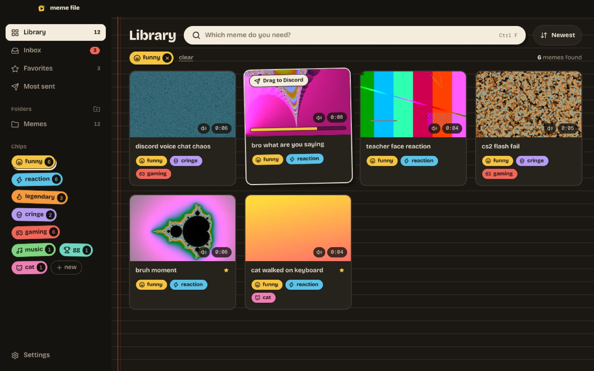
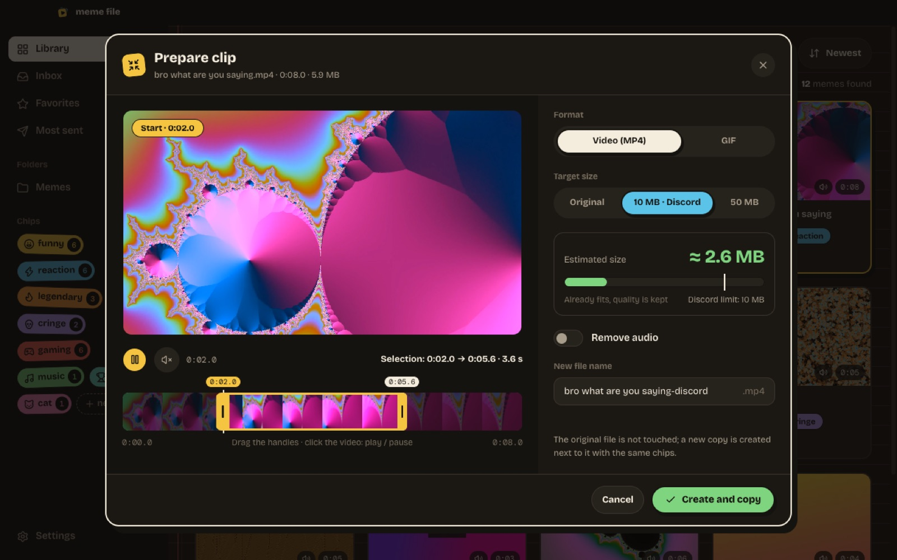
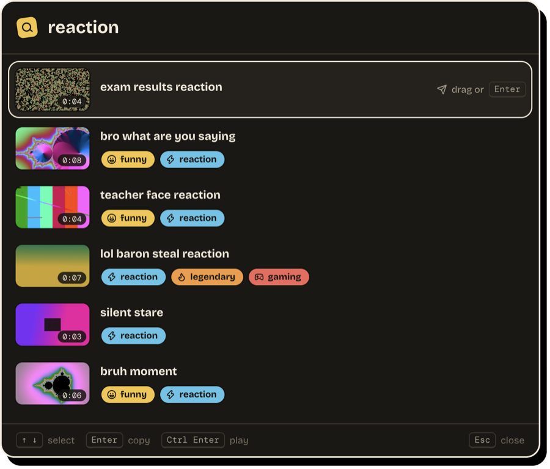
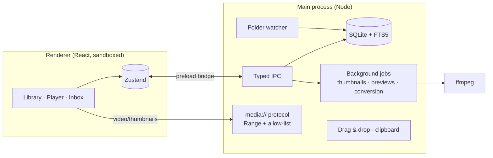

<div align="center">


# Meme File

**Your reaction video library: tag with chips, find instantly, drag & drop into Discord.**

[](https://github.com/Enver-Onur-Cogalan/meme-file/actions/workflows/build.yml)
[](https://github.com/Enver-Onur-Cogalan/meme-file/releases/latest)

[](LICENSE)

[**Download for Windows**](https://github.com/Enver-Onur-Cogalan/meme-file/releases/latest) · [Türkçe](README.tr.md) · [Project plan](docs/PLAN.md)

</div>



## Why?

Reaction videos and memes pile up by the hundreds, and finding the right one at the right moment takes minutes.
Meme File watches your folders, generates a thumbnail and a hover preview for every video, lets you tag them
with chips, and sends the one you need to a chat in a single gesture. Your files never move; the app only adds a
tagging layer on top.

## Features

<table>
<tr>
<td width="50%"></td>
<td width="50%"></td>
</tr>
<tr>
<td><b>Player</b> · loop, keyboard shortcuts, add chips by typing, drag-out area, copy / trim / fit / GIF</td>
<td><b>Chips</b> · 8 colors, 2000+ icons with search, or upload your own SVG/PNG</td>
</tr>
<tr>
<td></td>
<td></td>
</tr>
<tr>
<td><b>Inbox</b> · new videos in watched folders come up one by one; tag with 1-9, move on with Enter</td>
<td><b>Trim / Fit for Discord / GIF</b> · the preview follows the handles; bitrate is picked for the target size; the original is never touched</td>
</tr>
</table>



- **Quick search** · `Ctrl+Shift+Space` from anywhere, `Enter` copies the video
- **Send to Discord** · drag a card into the chat or `Ctrl+C` → `Ctrl+V`; works with multiple selection
- **Search** · by file name and chip name, accent-insensitive (Turkish-aware)
- **Chip filter** · combine chips with AND / OR
- **Hover preview** · scrub through a video by moving the mouse over its card
- **Unplayable formats** · HEVC (H.265), ProRes, AC-3 audio and mkv get a compatible copy in the background
- **File operations** · rename, move to Recycle Bin; moved or renamed files keep their chips
- **Organize** · favorites, most sent, duplicate detection, JSON backup
- **Background** · system tray, start with Windows, automatic updates
- **English and Turkish UI** · follows the system language, switchable in Settings

<br clear="right" />

### Games and anti-cheat

Safe to run alongside Vanguard, Easy Anti-Cheat, Ricochet and similar software: it doesn't touch game processes or
memory, doesn't hook the keyboard and doesn't draw in-game overlays. It only reads the folders you choose and uses
Windows' standard `RegisterHotKey` for the shortcut. The only network access is the update check.

## Under the hood

| Layer | Stack |
|---|---|
| Desktop | Electron 44 (sandbox + context isolation), electron-vite, electron-builder (NSIS) |
| UI | React 19, TypeScript, Tailwind CSS 4, Motion, Zustand, TanStack Virtual, Lucide |
| Data | Electron's built-in `node:sqlite`, FTS5 full-text search |
| Video | ffmpeg (thumbnails, preview strips, codec detection, conversion, size-targeted encoding, GIF) |
| Delivery | GitHub Actions (Windows runner), GitHub Releases, electron-updater |



Engineering notes:

- **Safe file access:** the renderer has no file system access. Videos are served through a custom `media://`
  protocol, only from folders added to the library, with HTTP Range support for seeking; path traversal is rejected.
- **Accent-insensitive search:** SQLite FTS5's `remove_diacritics` doesn't fold Turkish "ı" to "i", so both the
  index and the query are normalized before matching.
- **Size-targeted encoding:** bitrate is derived from the clip length; resolution and frame rate drop at low
  bitrates, and the encode is retried with a lower bitrate if the output overshoots.
- **Identity tracking:** files are matched by a content hash (size + first/last 1 MB), so a moved or renamed video
  keeps its chips, favorite flag and send count.
- **Large libraries:** queries on 5,000 videos take ~20 ms; above 120 videos the grid virtualizes. With the CPU
  throttled 4×, wheel scrolling stays under 18 ms per frame (p95). Fixing a refresh feedback loop cut idle main-thread
  work from ~75% to zero.
- **Localization:** one type-safe dictionary shared by main and renderer; a missing translation is a compile error,
  and English plurals are chosen without breaking the animated counters.
- **Tests:** unit tests, a 5,000-video performance budget, and ffmpeg integration tests that run on Windows on every push.

## Development

```bash
npm install
npm run dev         # run in development mode
npm test            # unit, performance and ffmpeg integration tests
npm run lint
npm run typecheck
```

The UI design lives in `design/`, the plan and decisions in `docs/PLAN.md`, and a manual Windows test guide
(in Turkish) in `docs/TEST-REHBERI.md`.

### Releasing

```bash
npm version patch   # e.g. 0.1.3 → 0.1.4, creates a commit and a tag
git push --follow-tags
```

A `v*` tag builds the Windows installer on GitHub Actions and publishes it to GitHub Releases. Installed apps
download the update in the background and show a "Restart" button.

> The installer isn't code-signed, so Windows SmartScreen shows a warning on first run: **More info → Run anyway**.

## License

[MIT](LICENSE) © Enver Onur Çoğalan. The bundled FFmpeg is GPL-licensed; see
[THIRD_PARTY_NOTICES.md](THIRD_PARTY_NOTICES.md).
