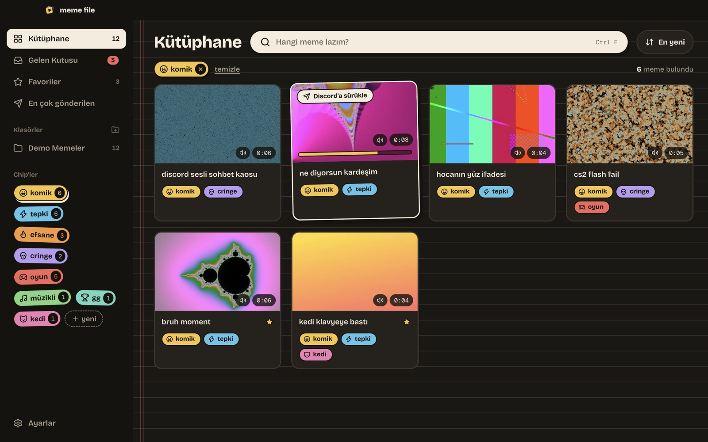
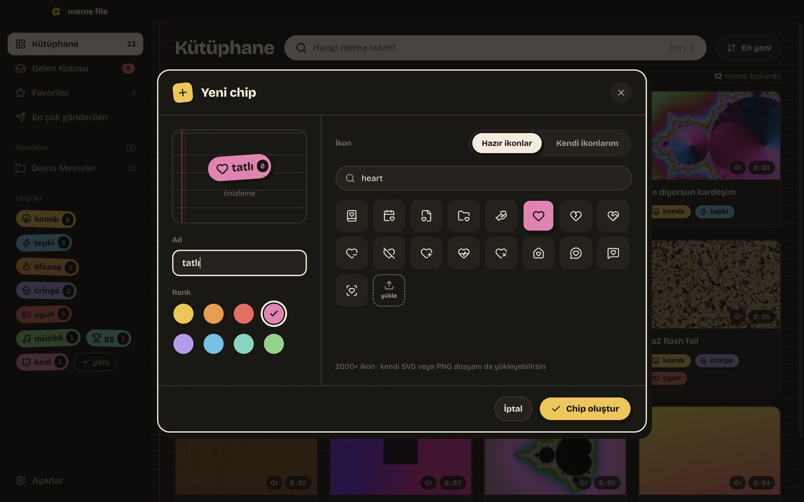
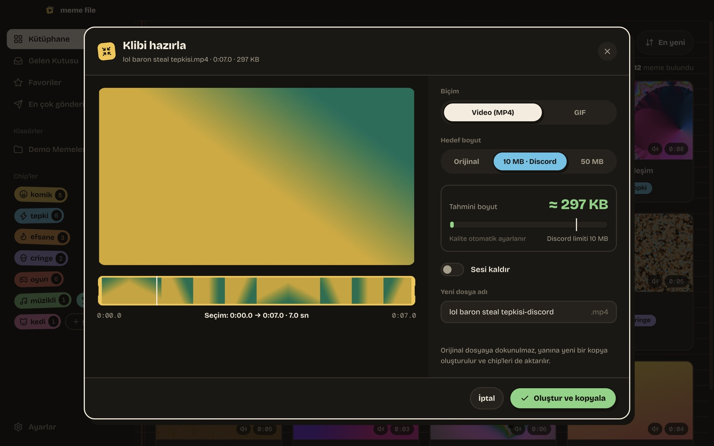
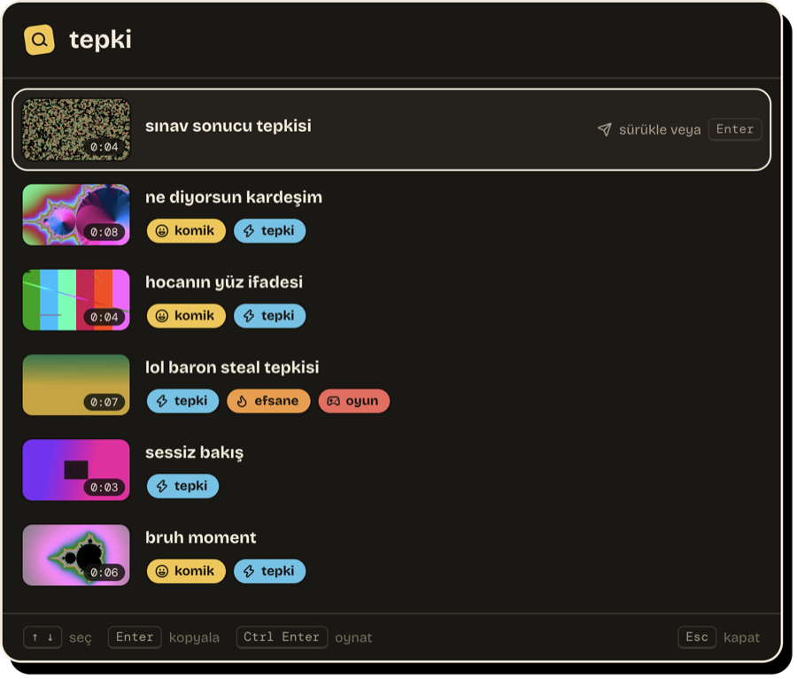
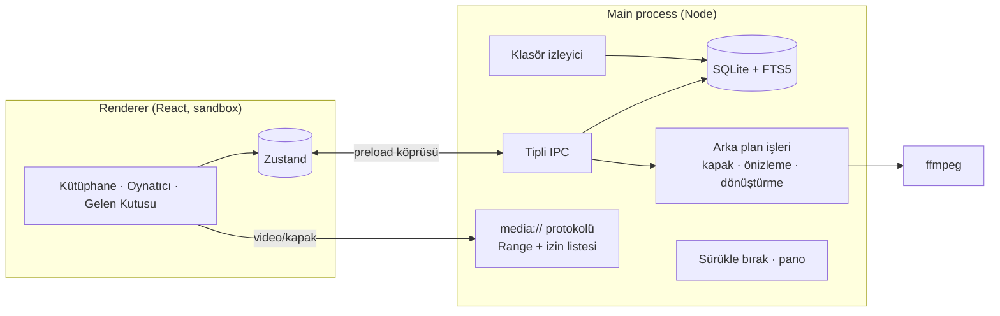

<div align="center">


# Meme File

**Video meme kütüphanen: chip'lerle etiketle, anında bul, Discord'a sürükle bırak.**

[](https://github.com/Enver-Onur-Cogalan/meme-file/actions/workflows/build.yml)
[](https://github.com/Enver-Onur-Cogalan/meme-file/releases/latest)

[](LICENSE)

[**Windows için indir**](https://github.com/Enver-Onur-Cogalan/meme-file/releases/latest) · [Test rehberi](docs/TEST-REHBERI.md) · [Proje planı](docs/PLAN.md)

</div>



> *A desktop app for organizing reaction videos and memes: tag them with colorful chips, find them instantly
> (Turkish-aware full-text search), preview by hovering, and drag & drop or Ctrl+C them straight into Discord.
> Built with Electron, React and SQLite; handles HEVC conversion, Discord's 10 MB limit and large libraries.*

## Neden?

Bilgisayarda yüzlerce meme videosu birikiyor, doğru anda doğru olanı bulmak ise dakikalar sürüyor. Meme File
klasörlerini izler, her videoya kapak ve önizleme üretir, chip'lerle etiketlemeni sağlar ve bulduğun videoyu tek
hareketle sohbete gönderir. Dosyaların yerinden oynamaz; uygulama sadece üstüne bir etiket katmanı koyar.

## Özellikler

<table>
<tr>
<td width="50%"></td>
<td width="50%"></td>
</tr>
<tr>
<td><b>Oynatıcı</b> · döngü, klavye kısayolları, yazarak chip ekleme, sürükle bırak alanı, kopyala / kırp / sığdır / GIF</td>
<td><b>Chip'ler</b> · 8 renk, 2000'den fazla ikon (Türkçe aramayla) ya da kendi SVG/PNG ikonun</td>
</tr>
<tr>
<td></td>
<td></td>
</tr>
<tr>
<td><b>Gelen Kutusu</b> · klasöre yeni düşen videolar sırayla gelir; 1-9 ile chip ver, Enter ile geç</td>
<td><b>Kırp / Discord'a sığdır / GIF</b> · hedef boyuta göre otomatik bit hızı ve çözünürlük; orijinal dosyaya dokunmaz</td>
</tr>
</table>



- **Hızlı arama** · `Ctrl+Shift+Space` ile uygulamayı açmadan ara, `Enter` ile kopyala
- **Discord'a gönder** · karttan sürükle bırak ya da `Ctrl+C` → Discord'da `Ctrl+V`; çoklu seçim desteklenir
- **Türkçe arama** · dosya adı ve chip adında, "basti" yazınca "bastı" bulunur
- **Chip filtresi** · birden fazla chip ile VE / VEYA
- **Fareyle önizleme** · kartın üzerinde gezdirdikçe video sarılır
- **Oynatılamayan formatlar** · HEVC (H.265), ProRes, AC-3 ses, mkv için arka planda uyumlu kopya
- **Dosya işlemleri** · yeniden adlandırma, Geri Dönüşüm Kutusu'na taşıma; taşınan/yeniden adlandırılan dosyalar chip'lerini korur
- **Düzen** · favoriler, en çok gönderilenler, aynı videoları bulma, JSON yedekleme
- **Arka planda** · sistem tepsisi, Windows ile başlatma, otomatik güncelleme

<br clear="right" />

### Oyunlar ve hile korumaları

Vanguard, Easy Anti-Cheat, Ricochet gibi korumalarla birlikte güvenle çalışır: oyun süreçlerine, belleğe ya da
klavyeye kanca atmaz, oyun içi overlay çizmez. Sadece seçtiğin klasörlerdeki dosyaları okur ve kısayol için
Windows'un standart `RegisterHotKey` mekanizmasını kullanır. İnternete sadece güncelleme denetimi için çıkar.

## Teknik detaylar

| Katman | Kullanılan |
|---|---|
| Masaüstü | Electron 44 (sandbox + context isolation), electron-vite, electron-builder (NSIS) |
| Arayüz | React 19, TypeScript, Tailwind CSS 4, Motion, Zustand, TanStack Virtual, Lucide |
| Veri | Electron'un içindeki `node:sqlite`, FTS5 tam metin arama |
| Video | ffmpeg (kapak, önizleme şeridi, codec tespiti, dönüştürme, hedef boyutlu kodlama, GIF) |
| Dağıtım | GitHub Actions (Windows runner), GitHub Releases, electron-updater |



Öne çıkan mühendislik kararları:

- **Güvenli dosya erişimi:** Renderer dosya sistemine erişemez. Videolar özel `media://` protokolüyle, sadece
  kütüphaneye eklenmiş klasörlerden ve HTTP Range desteğiyle (ileri sarma) sunulur; `..` ile kaçma denemeleri engellenir.
- **Türkçe uyumlu arama:** FTS5'in `remove_diacritics` seçeneği "ı"yı "i"ye çevirmediği için indeks ve sorgu
  Türkçe harfler sadeleştirilerek oluşturulur.
- **Hedef boyuta kodlama:** Klip süresinden bit hızı hesaplanır, düşük bit hızında çözünürlük ve kare hızı
  düşürülür; çıktı hedefi aşarsa daha düşük bit hızıyla yeniden denenir.
- **Kimlik takibi:** Dosyalar içerik özetiyle (boyut + ilk/son 1 MB) eşlenir; taşınan ya da yeniden adlandırılan
  video chip'lerini, favorisini ve gönderim sayısını kaybetmez.
- **Büyük kütüphaneler:** 5.000 videoda sorgular ~20 ms; 120 videodan sonra sanal liste devreye girer ve
  500 videoda kaydırırken 60 FPS korunur.
- **Test:** Birim testleri, 5.000 videoluk performans bütçesi ve her push'ta Windows üzerinde gerçek ffmpeg ile
  entegrasyon testleri.

## Geliştirme

```bash
npm install
npm run dev         # geliştirme modunda aç
npm test            # birim, performans ve ffmpeg entegrasyon testleri
npm run lint
npm run typecheck
```

Arayüz tasarımı `design/` klasöründe (Sticker Duvarı), plan ve kararlar `docs/PLAN.md` içinde.

### Yeni sürüm yayınlama

```bash
npm version patch   # 0.1.0 → 0.1.1, commit + etiket oluşturur
git push --follow-tags
```

`v*` etiketi GitHub Actions'ta Windows kurulum dosyasını derler ve GitHub Releases'a yükler. Kurulu uygulamalar
yeni sürümü kendileri indirir ve "Yeniden başlat" butonu gösterir.

> Kurulum dosyası kod imzasız olduğu için ilk açılışta Windows SmartScreen uyarı verir: **Ek bilgi → Yine de çalıştır**.

## Lisans

[MIT](LICENSE) © Enver Onur Çoğalan. Paketle birlikte gelen FFmpeg GPL lisanslıdır; ayrıntılar
[THIRD_PARTY_NOTICES.md](THIRD_PARTY_NOTICES.md) içinde.
