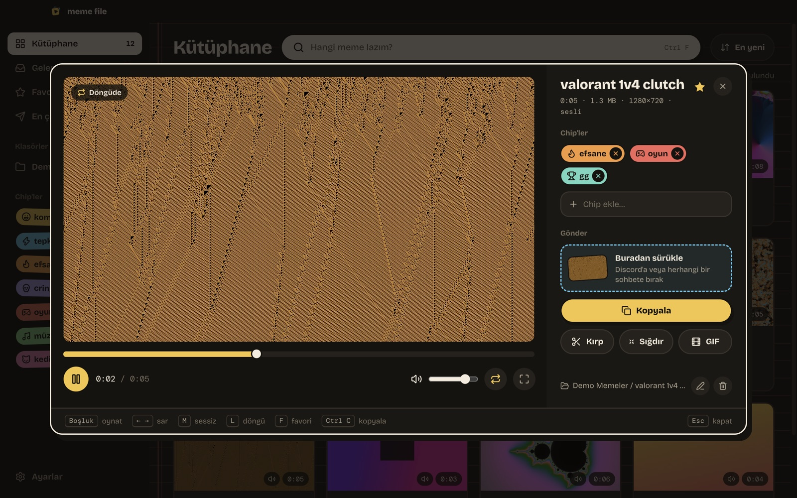
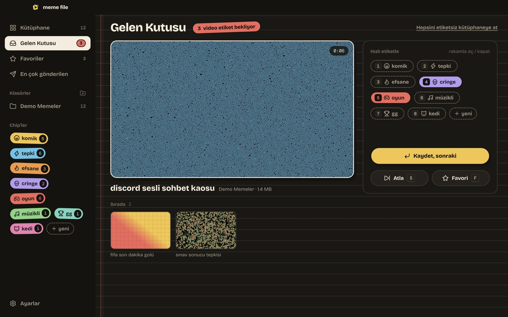
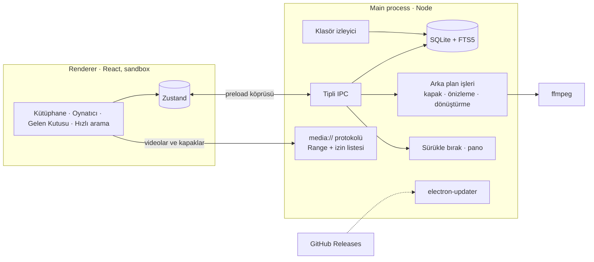

<div align="center">


# Meme File

**Tepki videosu kütüphanen.<br/>Chip'lerle etiketle, saniyeler içinde bul, doğrudan Discord'a sürükle.**

[](https://github.com/Enver-Onur-Cogalan/meme-file/actions/workflows/build.yml)
[](https://github.com/Enver-Onur-Cogalan/meme-file/releases/latest)

[](LICENSE)


[**Windows için indir**](https://github.com/Enver-Onur-Cogalan/meme-file/releases/latest) &nbsp;·&nbsp; [English](README.md) &nbsp;·&nbsp; [Test rehberi](docs/TEST-REHBERI.md) &nbsp;·&nbsp; [Proje planı](docs/PLAN.md)

<br/>


</div>

## Neden

Tepki videoları yüzlerce birikiyor ve doğru olanı an henüz komikken bulmak çok uzun sürüyor. Meme File
klasörlerini izler, her klibe kapak ve fareyle sarılabilen bir önizleme üretir, renkli chip'lerle etiketlemeni
sağlar ve lazım olanı tek hareketle sohbete gönderir. Dosyaların yerinden oynamaz; uygulama sadece üstüne bir
etiket katmanı ekler.

## Öne çıkanlar

<table>
<tr>
<td width="33%" valign="top"><b>Saniyeler içinde bul</b><br/>Ada ya da chip'e göre ara, chip'leri VE/VEYA ile birleştir, üzerine gelerek klibi sar.</td>
<td width="33%" valign="top"><b>Tek hareketle gönder</b><br/>Kartı Discord'a sürükle ya da <code>Ctrl+C</code> ile kopyalayıp yapıştır. Birden fazla videoyla da çalışır.</td>
<td width="33%" valign="top"><b>Her yerden çağır</b><br/><code>Ctrl+Shift+Space</code> ne yapıyorsan onun üstünde hızlı aramayı açar, oyunda bile.</td>
</tr>
<tr>
<td valign="top"><b>Discord limitine sığar</b><br/>Klibi kırpıp 10 MB'ın altına indir ya da GIF yap; orijinale dokunulmaz.</td>
<td valign="top"><b>Her şeyi oynatır</b><br/>HEVC, ProRes, AC-3 ses ve mkv dosyaları için arka planda uyumlu kopya hazırlanır.</td>
<td valign="top"><b>Hızlı kalır</b><br/>Sanal liste ve SQLite tam metin arama; kütüphane büyüdükçe de akıcı 60 FPS kaydırma.</td>
</tr>
</table>

## Nasıl çalışıyor

<table>
<tr>
<td width="58%" valign="top">
<br/>
<b>Kırp ve Discord'a sığdır</b> · önizleme tutamacın altındaki kareye atlar, sonra seçimi döngüde oynatır.
Tahmini boyut canlı güncellenir; kodlayıcı hedefe göre bit hızı, çözünürlük ve kare hızını seçer.
</td>
<td width="42%" valign="top">
<br/>
<b>Hızlı arama</b> · yaz, <code>↑</code> <code>↓</code> ile seç, <code>Enter</code> dosyayı kopyalar. Sürükle bırak da çalışır.
</td>
</tr>
</table>

## Özellikler

**Kütüphane**
- Klasör ekle (alt klasörler dahil); klasörler izlenir, yeni videolar rakam tuşlarıyla hızlı etiketleme için **Gelen Kutusu**'na düşer
- Kapaklar, fareyle sarılabilen önizleme, süre ve ses göstergesi, Discord'un 10 MB limitini aşanlara rozet
- Tarih, ad, boyut, süre ya da gönderim sayısına göre sıralama; favoriler, en çok gönderilenler, aynı videoları bulma

**Chip'ler**
- Sekiz çıkartma rengi, aramalı 2000'den fazla ikon ya da kendi SVG / PNG ikonun
- Oynatıcıdan yazarak chip ekleme (olmayan ad yeni chip oluşturur) ya da birden fazla videoyu birlikte etiketleme

**Gönderme**
- Karttan, oynatıcıdan ya da hızlı arama penceresinden sürükle bırak
- `Ctrl+C` dosyanın kendisini panoya koyar, herhangi bir sohbette `Ctrl+V` ile yapıştırılır

**Düzenleme**
- Kırp, 10 MB / 50 MB'a sığdır ya da GIF yap; sonuç panoya kopyalanır, yeni videolar chip'leri devralır
- Yeniden adlandırma (diskteki dosya da) ve Geri Dönüşüm Kutusu'na taşıma; taşınan ya da adı değişen dosyalar chip'lerini korur

**Uygulama**
- Türkçe ve İngilizce arayüz, sistem diline göre
- Sistem tepsisi, Windows ile başlatma, GitHub Releases'tan otomatik güncelleme, JSON yedekleme

<details>
<summary><b>Diğer ekran görüntüleri</b></summary>
<br/>

| Oynatıcı | Chip düzenleyici |
|---|---|
|  |  |
| **Gelen Kutusu** | **Kütüphane** |
|  |  |

</details>

### Hile korumalarıyla güvenli

Meme File; Vanguard, Easy Anti-Cheat, Ricochet ve benzerleriyle yan yana onlara dokunmadan çalışır: oyun
süreçlerine ya da belleğe erişmez, klavyeye kanca atmaz, oyun içi overlay çizmez. Sadece seçtiğin klasörleri okur ve
global kısayol için Windows'un standart `RegisterHotKey` mekanizmasını kullanır. Tek ağ isteği güncelleme denetimidir.

## Tasarım

Arayüz **Sticker Duvarı** adında küçük bir tasarım sistemi: sıcak koyu palet, mürekkep kenarlı ve kaydırılmış
gölgeli çıkartma chip'ler, çizgili defter zeminli kütüphane ve her yerde yay (spring) tabanlı hareket (kartlar
üzerine gelince eğilir, çıkartmalar ekrana "yapışır", kaydedilenler uçarak gider). Animasyonlar işletim sisteminin
"animasyonları azalt" ayarına uyar.


Yazı tipleri: [Bricolage Grotesque](https://github.com/ateliertriay/bricolage) ve [DM Mono](https://github.com/googlefonts/dm-mono), internetsiz çalışması için pakete dahil.
Tasarım tuvalinin kaynakları [`design/`](design/) klasöründe.

## Teknik detaylar



| Katman | Kullanılan |
|---|---|
| Masaüstü | Electron 44 (sandbox + context isolation), electron-vite, electron-builder (NSIS) |
| Arayüz | React 19, TypeScript, Tailwind CSS 4, Motion, Zustand, TanStack Virtual, Lucide |
| Veri | Electron'un içindeki `node:sqlite`, FTS5 tam metin arama |
| Video | ffmpeg: bilgi okuma, kapak, önizleme şeridi, codec dönüştürme, hedef boyutlu kodlama, GIF |
| Dağıtım | Windows üzerinde GitHub Actions, GitHub Releases, electron-updater |

**Mühendislik notları**

- **Kilitli dosya erişimi.** Renderer dosya sistemine erişemez. Videolar özel bir `media://` protokolüyle, sadece
  kütüphane klasörlerinden, ileri sarma için HTTP Range desteğiyle sunulur; `..` ile kaçma denemeleri reddedilir.
- **Hedef boyuta kodlama.** Bit hızı klip süresi ve hedef boyuttan hesaplanır; düşük bit hızında çözünürlük ve kare
  hızı düşer, çıktı hedefi aşarsa daha düşük bit hızıyla yeniden denenir.
- **Kalıcı kimlik.** Dosyalar içerik özetiyle (boyut + ilk/son 1 MB) eşlenir; uygulama dışında taşınan ya da adı
  değişen video chip'lerini, favorisini ve gönderim sayısını kaybetmez.
- **Aksandan bağımsız arama.** FTS5'in `remove_diacritics` seçeneği Türkçe "ı"yı çevirmediği için indeks ve sorgu
  eşleşmeden önce sadeleştirilir.
- **Tek sözlük, iki süreç.** Main ve renderer tip güvenli ortak bir çeviri tablosu kullanır; eksik çeviri derleme
  hatası verir, İngilizce çoğul biçimler animasyonlu sayaçları bozmadan seçilir.
- **Sürüm hattı.** Sürüm etiketi Windows makinesinde derlenir, taslak sürüme yüklenir, kurulum dosyası ve
  `latest.yml` birlikte doğrulandıktan sonra yayınlanır; kurulu uygulamalar kendiliğinden günceller.

## Performans

Geliştirme sırasında bir MacBook'ta, Chrome DevTools Protocol metrikleri ve gerçek fare tekerleği olaylarıyla ölçüldü.

| Senaryo | Sonuç |
|---|---|
| 5.000 videoda sorgu (tümü / arama / chip filtresi) | ~20 ms / 2 ms / 1 ms |
| 500 videoluk kütüphanede kaydırırken çizilen kart | ~40 (sanal liste) |
| İşlemci 4 kat yavaşlatılmışken tekerlekle kaydırma (p50 / p95 kare süresi) | 17 ms / 18 ms, 33 ms'yi aşan kare yok |
| Boştayken ana iş parçacığı yükü, yenileme döngüsü düzeltmesinden önce → sonra | ~%75 → %0 |

5.000 videoluk performans bütçesi CI'da birim testleri ve Windows'ta koşan ffmpeg entegrasyon testleriyle birlikte çalışır.

## Başlarken

1. [Son sürümden](https://github.com/Enver-Onur-Cogalan/meme-file/releases/latest) `MemeFile-x.y.z-setup.exe` dosyasını indir.
2. Kurulum dosyası kod imzasız olduğu için SmartScreen uyarı verir: **Ek bilgi → Yine de çalıştır**.
3. Meme klasörünü ekle. Bundan sonra güncellemeler kendiliğinden kurulur.

### Geliştirme

```bash
npm install
npm run dev         # uygulamayı anlık yenilemeyle aç
npm test            # birim, performans ve ffmpeg entegrasyon testleri
npm run lint
npm run typecheck
```

### Sürüm yayınlama

```bash
npm version patch   # sürümü artırır ve etiket oluşturur
git push --follow-tags
```

## Lisans

[MIT](LICENSE) © Enver Onur Çoğalan. Pakete dahil FFmpeg GPL lisanslıdır; ayrıntılar
[THIRD_PARTY_NOTICES.md](THIRD_PARTY_NOTICES.md) içinde.
